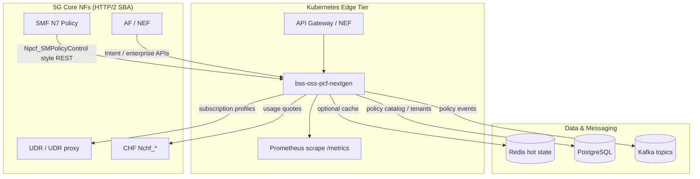

# Next-Generation 5G PCF — Architecture

This document describes the **cloud-native Policy Control Function (PCF)** implementation in this repository: the `bss-oss-pcf-nextgen` service and the reusable `bss_oss_pcf_nextgen` library, composed on top of the existing `bss-oss-pcf` policy engine.

**Operator and API guide:** [bss-oss-pcf-nextgen.md](bss-oss-pcf-nextgen.md) (environment variables, HTTP routes, metrics, embedding, Helm, limitations).

## 1. High-level architecture (textual diagram)



### Layering (clean architecture)

| Layer | Responsibility |
|--------|----------------|
| **adapters/http** | Actix Web routes, auth header checks, Prometheus histogram observation |
| **application** | Intent translation, fast path + circuit breaker, closed-loop suggestions, twin wrap, monetization heuristics, marketplace |
| **domain** | Pure types: intents, tenants, telemetry, quotes, listings |
| **infrastructure** | Circuit breaker, Kafka-style event publisher (logging stub; swap for `rdkafka`) |

The **core policy decision** reuses `bss_oss_pcf::PcfEngine` (QoS, charging rules, quota) so business logic stays centralized while the edge adds **multi-tenant overlays**, **intent mapping**, and **observability**.

## 2. Folder structure

```
crates/pcf-nextgen/
  Cargo.toml
  README.md
  src/
    main.rs                 # HTTP server binary
    lib.rs
    config.rs               # PCF_BIND, KAFKA_BROKERS, OTEL_*, PCF_REQUIRE_BEARER
    metrics.rs              # Prometheus: pcf_policy_decision_seconds, pcf_policy_decisions_total
    domain/                 # DTOs / value objects
    application/            # Use cases (orchestrator, intent, twin, monetization, …)
    infrastructure/         # Resilience + event bus abstractions
    adapters/http.rs       # REST handlers

openapi/
  pcf-nextgen-sba.yaml      # OpenAPI 3.0 for external consumers

examples/pcf-nextgen/
  ar-vr-low-latency.http    # REST client examples

sdk/typescript/
  pcf-nextgen-client.ts     # Minimal fetch-based SDK

helm/bss-oss-rust/templates/
  pcf-nextgen-deployment.yaml
  pcf-nextgen-service.yaml
```

## 3. Microservices mapping (Kubernetes)

One **deployable unit** is provided (`bss-oss-pcf-nextgen`) with logically separated **API families** (paths). In production you typically split into multiple Deployments **from the same image** with different resource profiles:

| Deployment profile | Routes | Notes |
|---------------------|--------|--------|
| **pcf-decision-edge** | `/npcf-sba/v1/policy/*`, `/paas/v1/*` | CPU pinned, HPA on RPS / p99 latency |
| **pcf-intelligence** | `/npcf-sba/v1/closed-loop/*`, optional ML sidecar | Heavier workloads |
| **pcf-commerce** | `/nchf-ready/*`, `/marketplace/*` | Rate limits + fraud checks |

Use **PodDisruptionBudgets**, **topology spread**, and **anti-affinity** (already exemplified in the main chart) for HA.

## 4. Real-time decision path (sub-10 ms goal)

- The hot path is **in-process**: `PolicyFastPath` → `PcfEngine::evaluate_policy` with **no blocking I/O** in the default build.
- **SLO verification**: scrape `pcf_policy_decision_seconds` and alert on histogram buckets around **0.004–0.010s** (4–10 ms). Under load, pin **replicas** and enable **CPU manager static policy** for stable latencies.
- For **UDR / SMF** calls, wrap external clients with **timeouts**, **bulkheads**, and the included **circuit breaker** to avoid tail latency amplification.

## 5. AI/ML adaptive policy (extension points)

Current code ships **deterministic intent mapping** (`IntentPolicyEngine`). Replace `translate()` with:

- **Behavior model** (sequence of QoS choices / app categories) stored in Redis / UDR.
- **Congestion predictor** fed by Kafka streaming features (cell load, throughput).
- **Bandit / contextual policy** for safe exploration within guardrails.

Wire models via a trait `IntentModel: Send + Sync` behind `Arc<dyn …>` to keep the HTTP layer stable.

## 6. Policy-as-a-Service & multi-tenant (B2B2X)

- `POST /paas/v1/tenants/{tenant_id}/policy/decision` applies **enterprise overlays** (`EnterpriseQoSRule`) on top of operator baseline decisions.
- Persist rules in **PostgreSQL**; cache hot tenants in **Redis** (stubs are ready via `RuntimeConfig` URLs).

## 7. Monetization & CHF

- `POST /nchf-ready/v1/quote` returns **rating_group**, **charging_key**, and **price** heuristics suitable for a CHF charging session.
- Integrate with **Nchf_ConvergedCharging** using the returned keys; this repo does not embed CHF protocol stacks.

## 8. Event-driven architecture (Kafka)

- `KafkaPolicyEventPublisher` logs structured events; replace with **rdkafka** producer in production.
- Suggested topics: `pcf.policy.decision`, `pcf.closed_loop.suggestion`, `pcf.marketplace.order`.

## 9. Observability

- **Prometheus**: `/metrics` on the PCF service.
- **Grafana**: import dashboards for `pcf_policy_decision_seconds` (histogram), `pcf_policy_decisions_total`, and SMF/NRF golden signals.
- **OpenTelemetry**: set `OTEL_EXPORTER_OTLP_ENDPOINT`; wire `tracing-opentelemetry` in `main.rs` when your collector is available.

## 10. Security (Zero Trust direction)

- Set `PCF_REQUIRE_BEARER=true` to enforce `Authorization: Bearer` on mutating routes (gateway should validate JWT / pass mTLS identity).
- Terminate **mTLS** at the **Ingress / mesh** (Istio, Linkerd) and propagate **SPIFFE** identities to downstream NFs.
- **OAuth2** client credentials for enterprise Policy-as-a-Service tenants.

## 11. Innovation features (implemented as extensible logic)

| Feature | Implementation |
|---------|------------------|
| **Intent-based engine** | `IntentPolicyEngine::translate` + `/npcf-sba/v1/policy/intent` |
| **Closed-loop automation** | `ClosedLoopController::suggest` + `/npcf-sba/v1/closed-loop/telemetry` |
| **Digital twin** | `DigitalTwin::wrap` + `/npcf-sba/v1/simulation/run` |
| **Marketplace API** | `PolicyMarketplace` + `/marketplace/v1/*` |

## 12. gRPC

The production pattern is **gRPC between internal microservices** (e.g. decision edge ↔ rules repository) while **N7-style JSON** faces SMF. Add a `tonic` service in a separate crate when you freeze `.proto` contracts.

## 13. CI/CD

The workspace **GitHub Actions** workflow (`ci-cd.yml`) builds all members; `bss-oss-pcf-nextgen` is included automatically once it is listed in the root `Cargo.toml` workspace.
